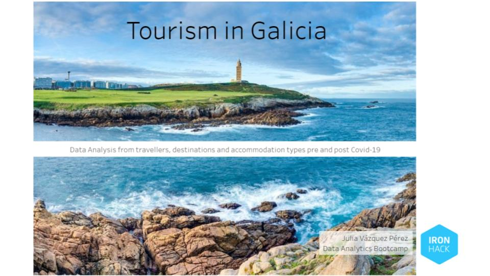

Julia Vázquez Pérez

## Description
Galicia: North-West of Spain (just on top of Portugal).

The aim of this project is to get a look over the tourism of this region pre and post Covid-19 so I can confirm or deny it's growth.

For that I am going to check the travellers, nights, average stay, zones, types of accommodation and travellers' origin and compare this data throught the months and years since 2001 to 2022.

I presented some hypothesis around the idea of the tourism regeneration after 2020 and I can confirm that the data shows that tourism in Galicia has indeed increased.

## Content

* [Install and run](#install)
* [Use this project](#use)
* [Presentation](#presentation)
* [Credits](#credits)
* [License](#license)

<h2><a id='install'>How to install and run the project</a></h2>
You will need:

* Jupyter Notebook (or another platform to read .ipynb files) and you'll need to import:
    * pandas
    * numpy
    * pymysql
    * sqlalchemy : create_engine
    * getpass
    * scipy.stats : ttest_1samp
* MySQL.

<h2><a id='use'>How to use the project</a></h2>

The first part of this project is gathering the data and start undestanding it. You can check that in <a href='https://github.com/JuliaVazquez/Project-Mid-Bootcamp/tree/main/1st_cleanning'>1st_cleanning</a> folder where I got all the downloaded data from my sources. I used 3 jupyter notebooks for this first cleanning.

After that first understanding I got some new datasets that I stored in new csv files. They can be found in <a href='https://github.com/JuliaVazquez/Project-Mid-Bootcamp/tree/main/2nd_cleanning'>2nd_cleanning</a> folder where I keep on cleanning this new datasets and trying to connect them. That part was tricky because of the way the data was stored, but I ended up with 5 new csv files. For this second cleanning I also used 3 diferent jupyter notebooks to work the 3 differents sets of data

In the next step I use the <a href='https://github.com/JuliaVazquez/Project-Mid-Bootcamp/tree/main/main_project'>main_project</a> folder, where those new files are storeed, to work with them using MySQL. I got the data that I need in Python and test the Hypothesis that I developped.

Finally I used all the information gathered from the dataframes, the insights from my Hypothesis testing and the visualization of the charts in Tableau to explain visualy in my presentation all the knowledge I extracted from it.

<h2><a id='presentation'>Project Presentation</a></h2>
Here you can find the <a href='https://public.tableau.com/app/profile/julia.v.zquez/viz/Mid-BootcampProject_16654964405130/ProjectPresentation'>Tableau Presentation</a> of this project where is all the graphic information about tourism in Galicia.

<h2><a id='credits'>Credits</a></h2>
I colected the data from different open-data sources:

* <a href='https://abertos.xunta.gal/portada'>Galician data base</a>
* <a href='https://datos.gob.es/es/catalogo'>Spanish data base</a>

<h2><a id='license'>License</a></h2>
<h6>Copyright (c) 2020  Julia Vázquez Pérez

Permission is hereby granted, free of charge, to any person obtaining a copy
of this software and associated documentation files (the "Software"), to deal
in the Software without restriction, including without limitation the rights
to use, copy, modify, merge, publish, distribute, sublicense, and/or sell
copies of the Software, and to permit persons to whom the Software is
furnished to do so, subject to the following conditions:

The above copyright notice and this permission notice shall be included in all
copies or substantial portions of the Software.

THE SOFTWARE IS PROVIDED "AS IS", WITHOUT WARRANTY OF ANY KIND, EXPRESS OR
IMPLIED, INCLUDING BUT NOT LIMITED TO THE WARRANTIES OF MERCHANTABILITY,
FITNESS FOR A PARTICULAR PURPOSE AND NONINFRINGEMENT. IN NO EVENT SHALL THE
AUTHORS OR COPYRIGHT HOLDERS BE LIABLE FOR ANY CLAIM, DAMAGES OR OTHER
LIABILITY, WHETHER IN AN ACTION OF CONTRACT, TORT OR OTHERWISE, ARISING FROM,
OUT OF OR IN CONNECTION WITH THE SOFTWARE OR THE USE OR OTHER DEALINGS IN THE
SOFTWARE.
</h6>

